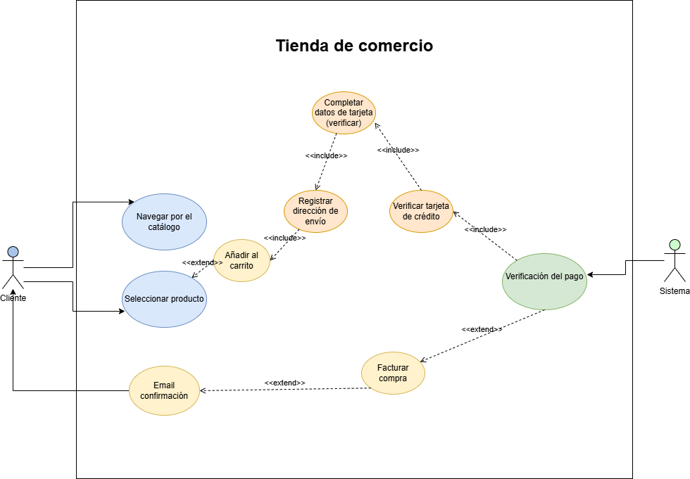

# comercio-electronico

## Ejercicio1 :
    Una tienda en linea necesita un sistema que permita a los clientes comprar productos a traves de un sitio web.

    Como parte de los requisitos funcionales del sistema debe incluir los siquientes procesos:

**1.- El cliente** puede navegar por el catálogo para visualizar los productos disponibles:

Le refiere a la funcionalidad básica de una tienda en línea o plataforma de comercio electrónico, donde el cliente tiene la posibilidad de explorar un catálogo de productos. A través de la navegación, el cliente puede ver los productos disponibles, generalmente organizados por categorías (como ropa, electrónica, etc.).

---

**2.- El cliente** Una vez que  selecciona un producto, tiene la opción de colocar el artículo en el carrito:

La acción que puede realizar el cliente después de elegir un producto en una tienda en línea. Una vez que el cliente ha visualizado los detalles del producto (como precio, descripción, y opciones de tamaño o color), tiene la opción de agregarlo al carrito de compras.

---
**3.- El cliente** Para completar la compra, el cliente debe realizar las siguientes acciones:

- Informar su dirección de envío (extensión opcional si ya tiene una dirección registrada):

    El cliente proporciona la dirección donde desea recibir los productos. Si ya tiene una dirección registrada en el sistema, puede seleccionar esa dirección, o si lo prefiere, puede ingresar una nueva dirección de envío.

- Completar los datos de su tarjeta de crédito para el pago:

    El cliente ingresa los datos de su tarjeta de crédito (número, fecha de vencimiento y código de seguridad) o elige otro método de pago disponible (como PayPal o transferencia bancaria). Esto se usa para procesar el pago y completar la compra.


---
NOTA: 
    Una vez ambos pasos se completan, el cliente confirma la compra y se procesa el pedido.


4.- Durante la transacción, el sistema debe realizar las siguientes acciones:

- Verificar los datos de la tarjeta de crédito: El sistema valida la información proporcionada (número de tarjeta, fecha de vencimiento, código de seguridad) mediante un servicio de procesamiento de pagos para asegurarse de que la tarjeta sea válida y tenga fondos suficientes.

- Facturar la compra: Una vez que el pago es aprobado, el sistema genera una factura con los detalles de la compra (productos, precio total, impuestos, etc.) y la registra en el sistema.

- Enviar un e-mail de confirmación: El sistema envía automáticamente un correo electrónico al cliente con la confirmación de la compra, incluyendo los detalles de los productos adquiridos, el monto total, la dirección de envío y el estado del pedido.

Estas acciones aseguran que la compra se procese correctamente y que el cliente reciba la información necesaria para su seguimiento.
--

# Diagrama de Casos de Uso:
**Cliente:**


Navegar por el catálogo > Seleccionar producto
Seleccionar producto > Agregar al carrito
Agregar al carrito > Informar dirección de envío (opcional)
Informar dirección de envío > Completar pago
Completar pago > Verificar tarjeta de crédito (<<include>>)
Verificar tarjeta de crédito > Facturar compra
Facturar compra > Enviar e-mail de confirmación
Sistema:

Verificar tarjeta de crédito (<<include>> con Completar pago)
Facturar compra (<<include>> con Verificar tarjeta de crédito)
Enviar e-mail de confirmación (<<extend>> con Facturar compra)
Banco/Procesador de pagos:

Verificar tarjeta de crédito (relacionado con el caso de uso de Completar pago)


**Ejemplo:**
````
  +-----------------------------------+
  |          Sistema de Comercio      |
  +-----------------------------------+
         |                    |
         |                    |
   +-----v------+        +-----v-------+
   |   Cliente  |        | Banco/Procesador de pagos |
   +------------+        +----------------------+
        |                        |
        v                        v
 +--------------+              +--------------------+
 | Navegar por el |            | Verificar tarjeta  |
 | catálogo      | <---------- | de crédito (include)|
 +--------------+              +--------------------+
        |
        v
 +-------------------+    
 | Seleccionar       |   
 | producto          |
 +-------------------+
        |
        v
 +-------------------+
 | Agregar al carrito|
 +-------------------+
        |
        v
 +--------------------------+
 | Informar dirección de    |
 | envío (opcional)         |
 +--------------------------+
        |
        v
 +------------------------+
 | Completar pago         |
 +------------------------+
        |
        v
 +------------------------+
 | Verificar tarjeta de   |   <<include>> 
 | crédito                |
 +------------------------+
        |
        v
 +------------------------+
 | Facturar compra        |   <<include>>
 +------------------------+
        |
        v
 +------------------------+
 | Enviar e-mail de       |   <<extend>>
 | confirmación           |
 +------------------------+

````
---
# Explicación de relaciones:
 **Include:**

Verificar tarjeta de crédito está incluido en Completar pago. Esto significa que la verificación de la tarjeta es un paso obligatorio dentro del proceso de pago.
Facturar compra se incluye como parte de Verificar tarjeta de crédito, ya que solo se realiza la facturación si la tarjeta de crédito es validada correctamente.

**Extend:**

Enviar e-mail de confirmación es una extensión de Facturar compra, porque no siempre es necesario enviar un correo de confirmación en otros procesos de la tienda, pero en este caso se extiende para ser parte del flujo cuando la compra es exitosa.


---

# Ejercicio 2:
Ejercicio 2: Realiza la especificación de Casos de Uso
Realiza la especificación de casos de uso de la siguiente imagen.
--



---

# **Casos de uso Cliente:** <br>
**Registrarse:**

**El cliente:**
 proporciona sus datos personales para crear una cuenta en el sistema.
Flujo principal: El cliente ingresa su información (nombre, correo, etc.), y el sistema lo registra.
Alquilar películas:

- El cliente selecciona una película para alquilar.
Flujo principal: El cliente busca y selecciona la película, paga por el alquiler, y el sistema confirma la transacción.
Reservar películas:

- El cliente reserva una película que no está disponible en ese momento.
Flujo principal: El cliente selecciona la película y, si está fuera de stock, la reserva para recibirla cuando esté disponible.


**Relaciones:**    
El caso de uso Alquilar películas y Reservar películas son independientes, pero ambos requieren que el cliente esté registrado.

**Ejemplo:**
````       +----------------------+
       |     Cliente          |
       +----------------------+
         |        |         |
         v        v         v
 +---------------+   +----------------+
 | Registrarse   |   | Alquilar pelis  |
 +---------------+   +----------------+
                       |
                       v
               +-------------------+
               | Reservar películas |
               +-------------------+

````

-----------

# Caso de Uso: Proveedor de Películas
**Actor:**

**Proveedor:**
 Entidad o persona que suministra las películas al sistema.
Casos de uso: <br>
Abastecer películas al administrador: <br>
 - El proveedor ofrece nuevas películas al administrador del sistema según la disponibilidad de su inventario.<br>
 - Flujo principal: El proveedor entrega un listado de películas disponibles al administrador, quien las agrega al sistema para que los clientes puedan alquilarlas o reservarlas.<br>

**Relación:<br>**
Abastecer películas al administrador depende de la existencia de las películas en el inventario del proveedor. Si el proveedor tiene disponibilidad, se realiza el abastecimiento.<br>
**Ejemplo:**
````
       +----------------------+
       |      Proveedor       |
       +----------------------+
                |
                v
      +-----------------------+
      | Abastecer películas   |
      | al administrador      |
      +-----------------------+

````

--------

# Caso de Uso: Administrador del Sistema
**Actor:**

**Administrador:** Persona encargada de gestionar el sistema, incluyendo la gestión de clientes, alquileres, reservas y películas.
Casos de uso:
Registrar clientes:

Descripción: El administrador crea nuevas cuentas de clientes en el sistema.
Flujo principal: El administrador ingresa los datos del cliente (nombre, correo, etc.), y el sistema registra al cliente para que pueda alquilar o reservar películas.
Registrar alquiler:

Descripción: El administrador registra un alquiler de película cuando un cliente realiza un alquiler.
Flujo principal: El administrador selecciona la película alquilada y asocia la transacción al cliente, procesando el pago y actualizando el inventario.
Registrar reserva:

Descripción: El administrador registra una reserva cuando una película no está disponible y el cliente solicita una futura entrega.
Flujo principal: El administrador toma la solicitud del cliente, la asocia con la película reservada y actualiza el sistema para notificar al cliente cuando la película esté disponible.
Registrar películas:

Descripción: El administrador agrega nuevas películas al sistema, basándose en las que el proveedor ha abastecido.
Flujo principal: El administrador ingresa la información de la película (título, género, descripción, etc.) y la agrega al catálogo para que los clientes puedan alquilar o reservar.
Actualizar al proveedor:

Descripción: El administrador actualiza al proveedor sobre el estado del inventario y las necesidades de nuevas películas.
Flujo principal: El administrador comunica al proveedor si se necesitan más copias de ciertas películas o si se deben agregar nuevos títulos al catálogo.<br>
**Ejemplo:**

```` +-----------------------+
        |  Administrador del    |
        |      Sistema          |
        +-----------------------+
          |        |         |        |        |
          v        v         v        v        v
  +---------------+  +----------------+  +----------------+
  | Registrar     |  | Registrar      |  | Registrar      |
  | clientes      |  | alquiler       |  | reserva        |
  +---------------+  +----------------+  +----------------+
          |
          v
  +-------------------+
  | Registrar         |
  | películas         |
  +-------------------+
          |
          v
  +--------------------+
  | Actualizar al      |
  | proveedor          |
  +--------------------+
````

